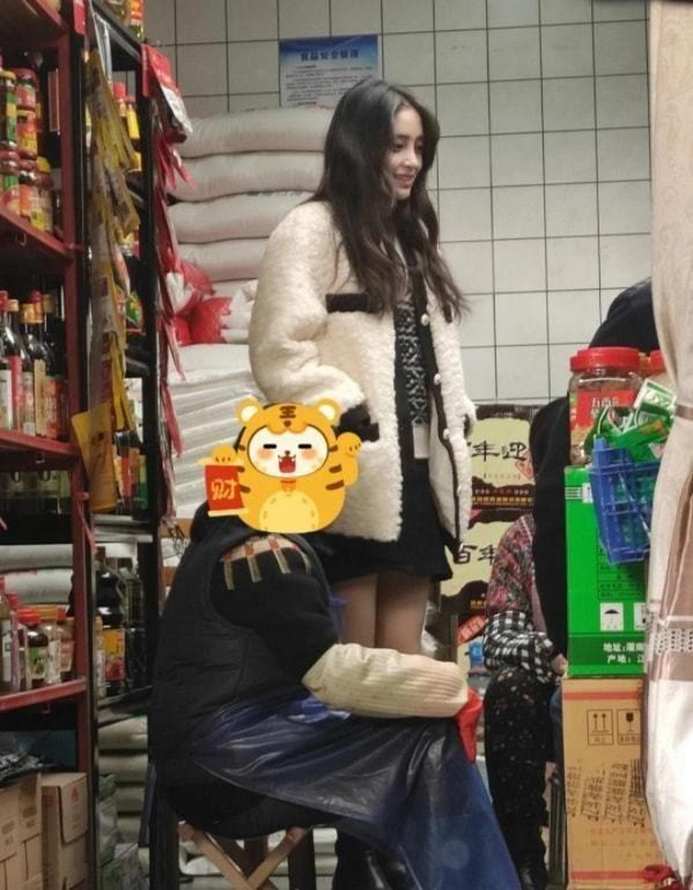

# Baby真是好妈妈！素颜穿休闲装带儿子逛街，小海绵继承爸爸大长腿

近日网上曝光了一组Angela baby带着儿子小海绵一起逛街的路透照，虽然已经跟黄晓明离婚，但是baby却依旧没有放弃对儿子的陪伴，可以说是一个十足的好妈妈，这一次母子俩逛街也是相当的温馨。

小海绵很好地继承了父母的优点，这一次逛街特意选择了一**件橙色的连帽羽绒服**，在人群中显得格外亮眼，同时配上**收脚的黑色运动裤，清爽又利落**，虽然今年才5岁，但是却完美继承了爸爸的大长腿，背影都显得非常帅气。

**Baby私服穿搭休闲又低调**

**黑色短款面包服+黑色紧身裤+长筒靴+鸭舌帽**

**造型关键词：顺色组合、显高、清爽**

Baby的私服穿搭向来都比较低调，这一次跟儿子逛街也不例外，全身所选择的单品都是**以黑色系为主，保持了很强的休闲感**，同时为了能够更好的展现身材优点，以起到扬长避短的作用，baby还在搭配中加入了下面这几个显高显瘦的小技巧。

**①选择深色系顺色搭配，打造延伸效果**

深色系由于对它的饱和度进行了调低，形成了很**内敛**的感觉，在视觉上可以有效地产生**收缩效果，**轻松模糊掉身材上的小赘肉，从而给人一种**显瘦的感觉。**

像baby的这套搭配中，全身上下都采用了**纯黑色组合**，这样一来不仅可以利用我们上面所说的收缩功能，同时**深色叠加，营造出来的延伸效果，也可以大大拉长身材比例，增加显高感。**

**②上短下高搭配，突出高腰大长腿**

除了色彩有着很不错的显高作用之外，单品款式组合更是出彩，**经典的上短下高组合**，轻松**突出了高腰线**，并且让**腿部线条更加直观的展现出来**。

尤其是baby美腿线条比较突出，还加入了**紧身裤来进行打底**，配上同色过膝长筒靴后，不仅增加了**造型的清爽感**，同时还能够跟上衣蓬松的面包服形成反差，**让整个造型看上去休闲又时尚。**

**显高技巧补充：适当露腿，更显高**

上短下高搭配，其实最关键的一点就是在视觉上人为地拉高了腰线，从而对身材比例进行了二次调整，除了像baby上面的这一套私服一样，选择深色系组合之外，还可以**尝试适当露腿处理。**

**示范：白色高领毛衣+v领马甲+黑色高腰短裙**

**造型关键词：层次感、撞色、甜美**

就拿baby身上的这一套毛衣造型穿搭来举例，上身明显是**以清雅的白色系为主**，配合上**黑色的高腰超短裙**之后，在色彩上就会产生很好的**对比感**，利用经典的**色彩反差**来**强调腰部的分界线，**就算上下装模糊了腰线，也不会显矮。

同时超短裙选择了**a字款**，剪裁长度到大腿位置，**露腿的处理**可以更好地**将视觉重点下移**，从而加强腿部线条修长的印象，配合上**内短外长的层次感分布，**既增加了造型的甜美清新，又可以突出整体穿搭的条理，从而增加造型的显高效果。

Baby真是好妈妈！素颜穿休闲装带儿子逛街，小海绵继承爸爸大长腿

