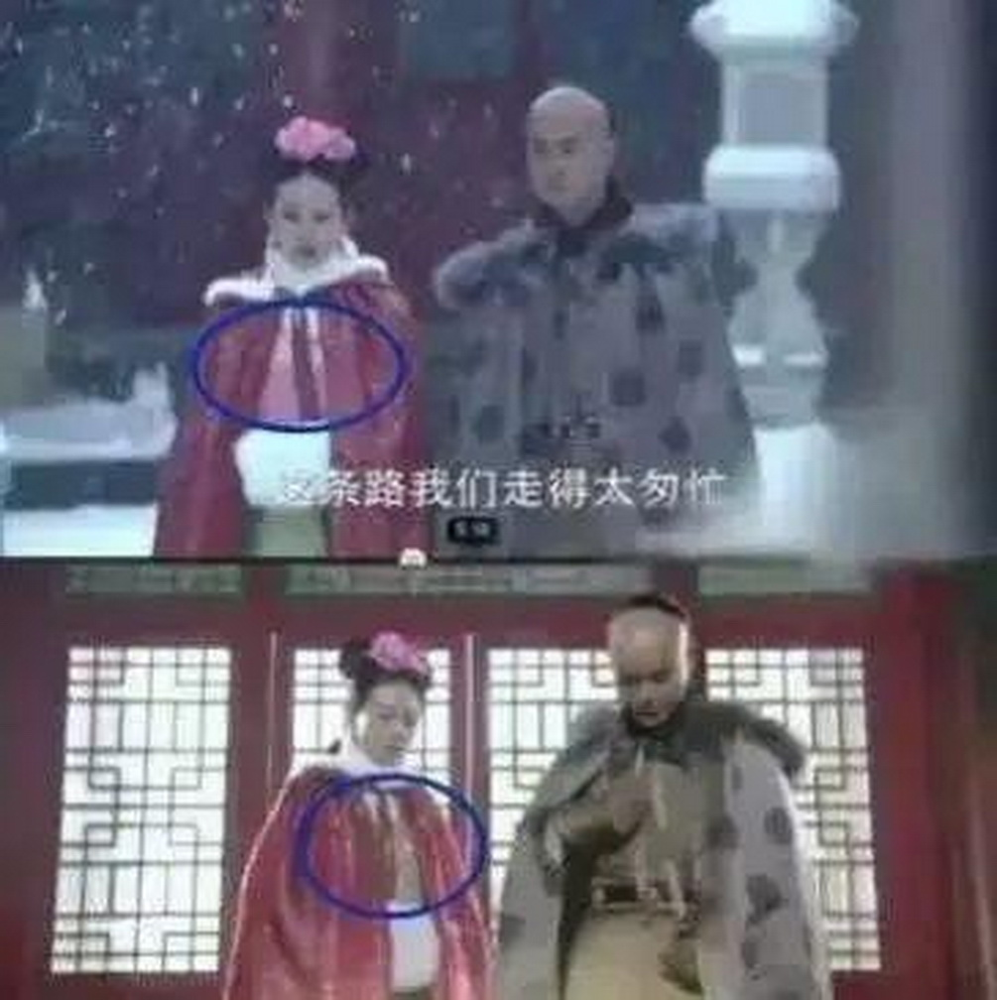
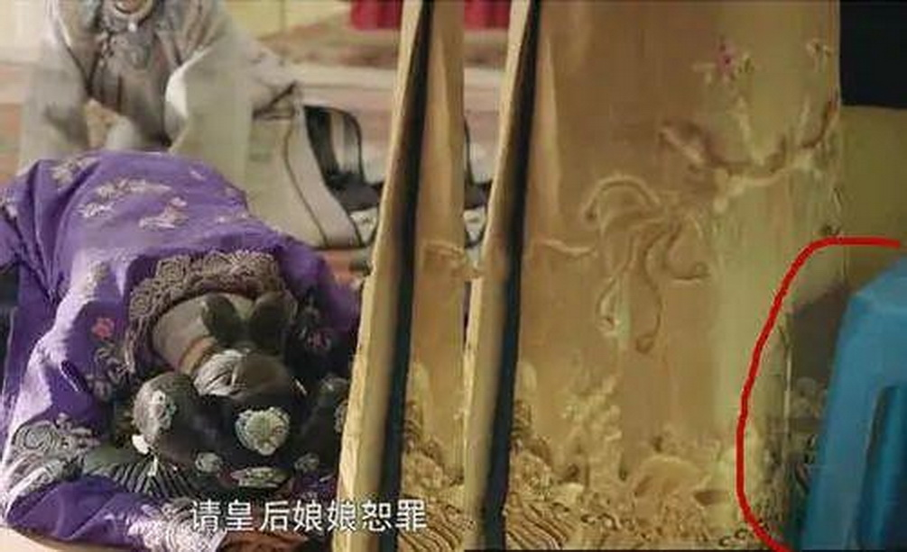
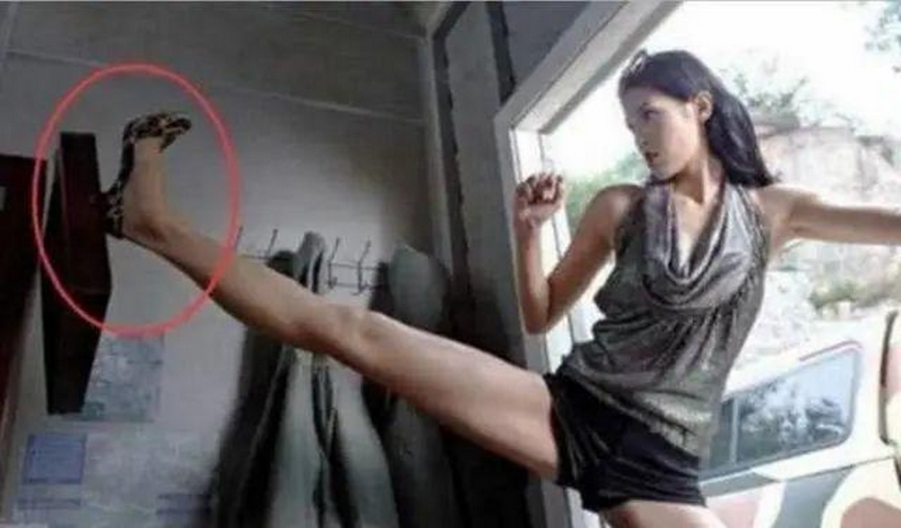
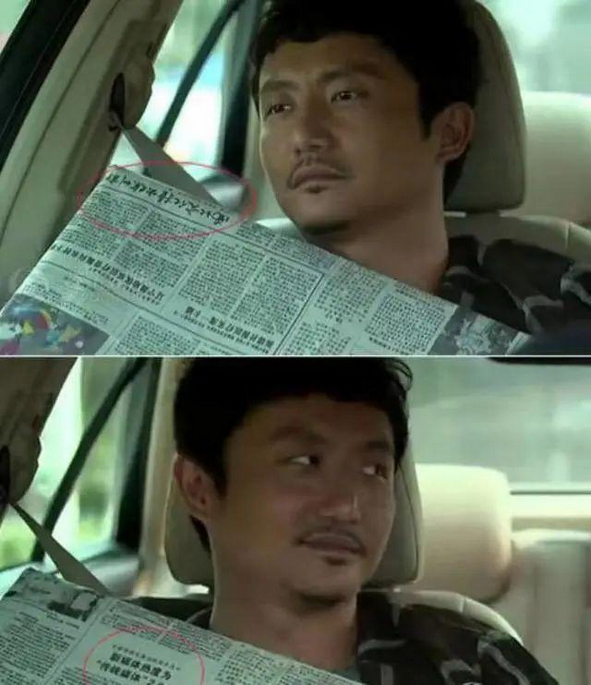
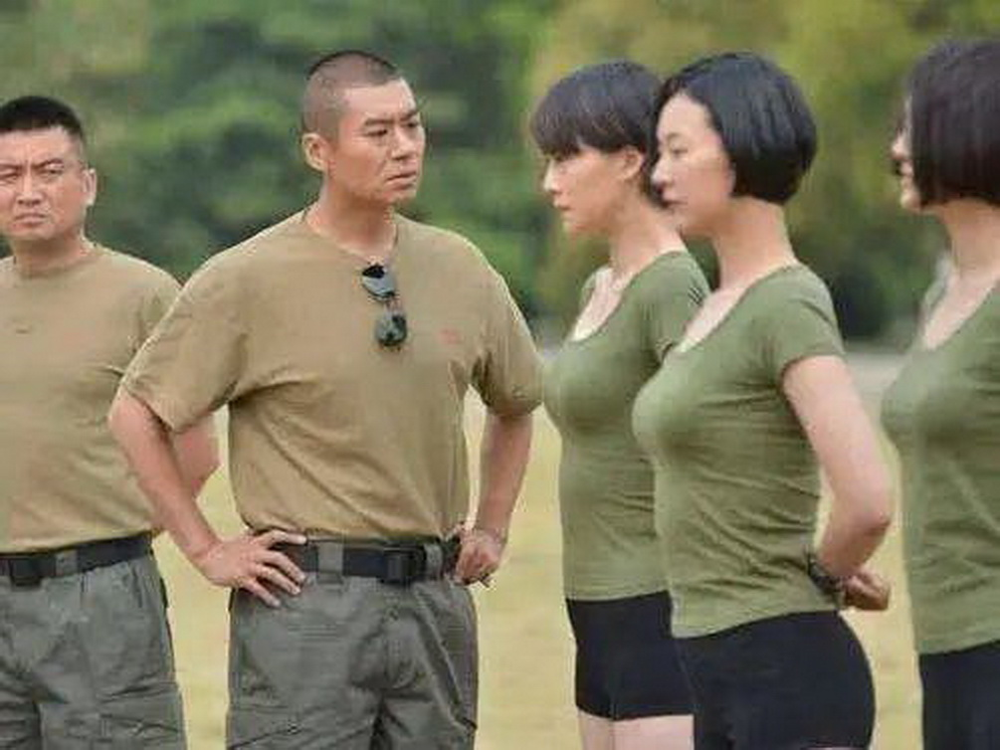
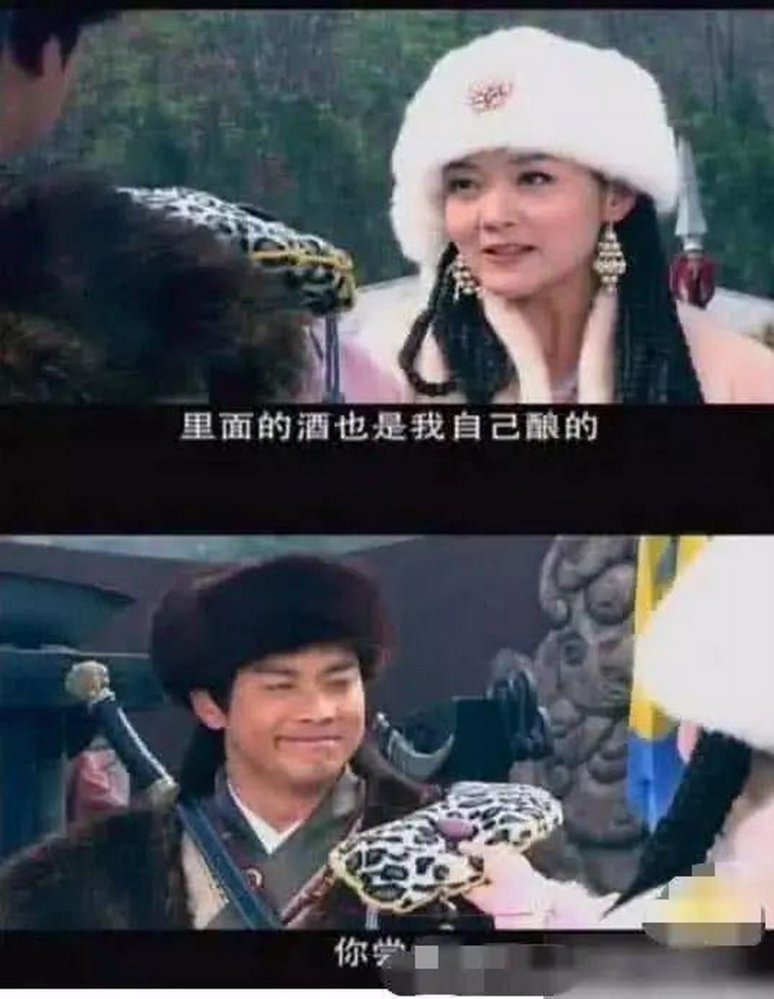
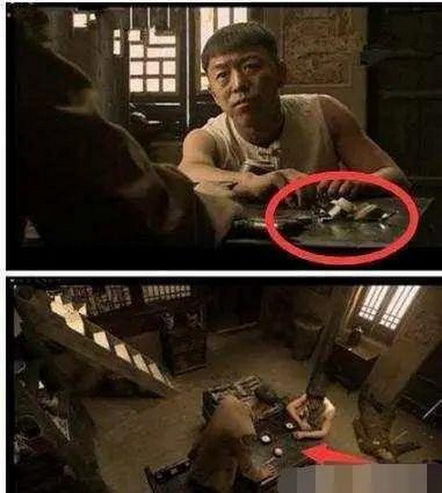

# 令人尴尬的穿帮镜头，皇后起身坐的蓝色塑料椅子，令人非常想笑了

影视剧镜头看点多，这张图片是讲述清朝的一张图片，首先从大秃脑瓜子就可以看出来，这么个仿历史的头顶都做得那么逼真，可是导演能不能用点心，不要在衣服上出问题!刚刚在外面的时候女演员衣服还是红色的，怎么一进屋子就变绿了呢!这是遇冷遇热会变色的衣服嘛!清朝这么先进呢?

而就连前段时间大热，并且一直声称尊重传统历史的延禧攻略，也出现了穿帮的镜头。一个妃子向皇后请罪的时候，秦岚饰演的富察皇后起身所拍到的座椅，瞬间引起人们的注意，只见她身后放着一只蓝色塑料椅子，看到这个场面也是令人非常想笑了。

这样的画面第一印象就是美腿，张蓝心，头以下全是腿的感觉。只是这样的一个小小的东西为啥就非要那么大动干戈呢?手扶一下又能怎么样?只是弱弱地发现，这个高跟鞋是不是没有鞋跟。

涂松岩老师的演技非常的高，可是一直不受观众的认知，还是去年参加《演员》才火了起来，在图片上的这部戏里面还是那种符合他柔情的表演风格，但是也太不认真了吧，第一眼看报纸，报纸上还有彩色图片，第二次怎么就没有了，难道就是因为他看了一眼驾驶位吗?难道司机是一个倾城女子吗?

先看《特种兵之火凤凰》，是当年小编非常喜欢的一部戏了，每个女兵性格鲜明，容貌出众，英姿飒爽，但是你仔细看的话，会不会觉得她们穿的有哪里不对劲儿呢?不知道你是否能看得出来呢?

一个女生递给一位男子一个酒壶，这个酒壶就非常的古怪了。再说里面的酒是自己酿的，让这名男子尝一尝。但是从镜头中，可以看出来这个酒壶根本就不是酒壶，分明是一个我们日常就可以用到的一个暖宝。

【民兵葛二蛋】，这部电视剧有影帝黄渤的参加，当时可是火了一把啊!特别是在第33集，赌博时把麦子把本人盖着的碗摔得细碎，去开葛二蛋碗后那碎碗木有了!

